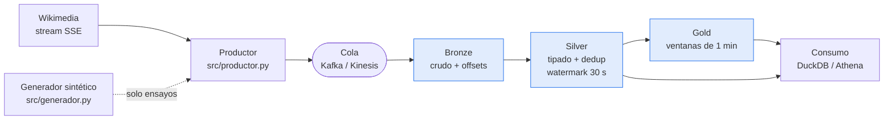
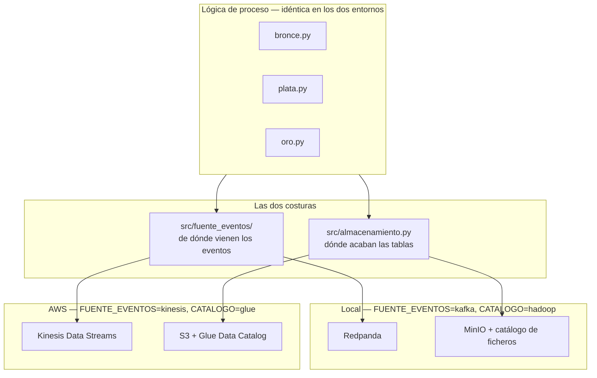

# Arquitectura

Dos entornos, una sola lógica. Este documento existe para enseñar dónde está
exactamente la costura entre lo que cambia y lo que no.

## El pipeline

Las tres tablas son Iceberg. Cada flecha entre ellas es un job de Spark
Structured Streaming con su propio punto de control.

## Las dos costuras

Todo lo que difiere entre local y AWS vive en dos módulos, y en ninguno más.
Si aparece un `if entorno == "aws"` dentro de un job, la abstracción está rota.

La selección es por variable de entorno, no por rama en el código.

## Equivalencias

| Capa | Local | AWS |
|---|---|---|
| Cola | Redpanda (API Kafka) | Kinesis Data Streams |
| Proceso | Spark en contenedor | EMR Serverless |
| Objetos | MinIO (API S3) | S3 |
| Catálogo | ficheros (`version-hint.text`) | Glue Data Catalog |
| Consulta | DuckDB | Athena |
| Infraestructura | Docker Compose | Terraform |

MinIO habla S3 y Redpanda habla Kafka, así que la ruta `s3a://` y el cliente de
consumo son los mismos en los dos sitios. Es la razón de esta elección de stack,
no una casualidad.

## Por qué el contrato es la tabla, no el motor

Spark escribe las tablas. **DuckDB las lee sin haber participado en la
escritura y sin conocer el catálogo**: abre la tabla por su ruta y sigue el
`version-hint.text` que dejó el catálogo de ficheros. No hay exportación, no hay
copia, no hay proceso intermedio.

Ese es el argumento de Iceberg, y `src/consumo_duckdb.py` existe para
demostrarlo: las mismas preguntas que responde `src/jobs/consultas.py` desde
Spark, respondidas desde otro motor, con los mismos números.

En AWS el papel de DuckDB lo hace Athena sobre Glue. Cambia el motor; la tabla
no.
